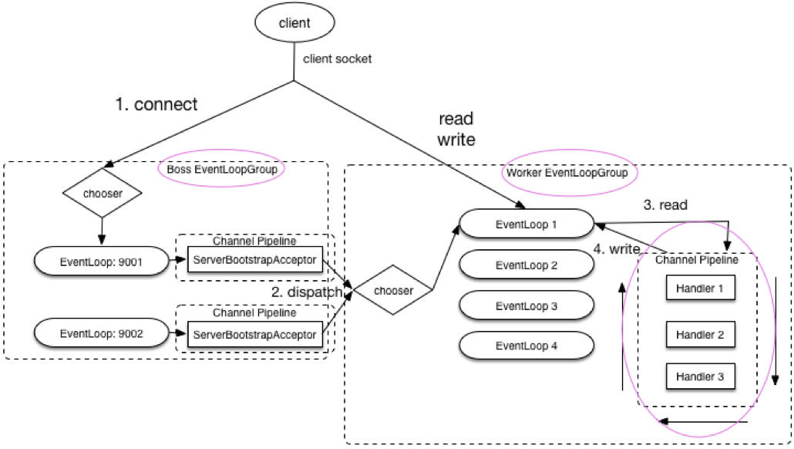
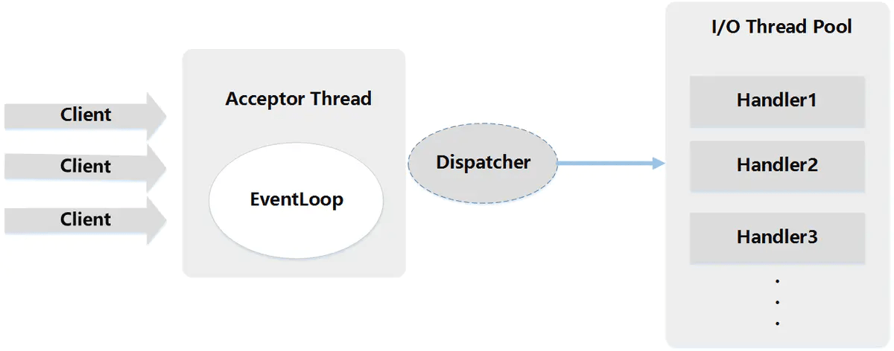
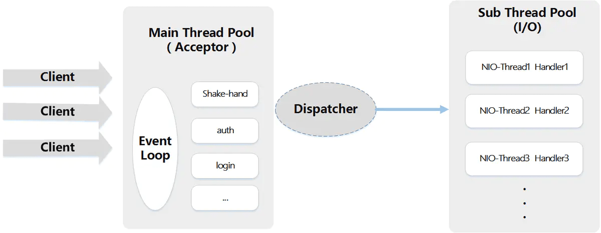
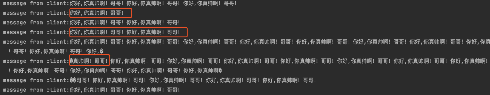
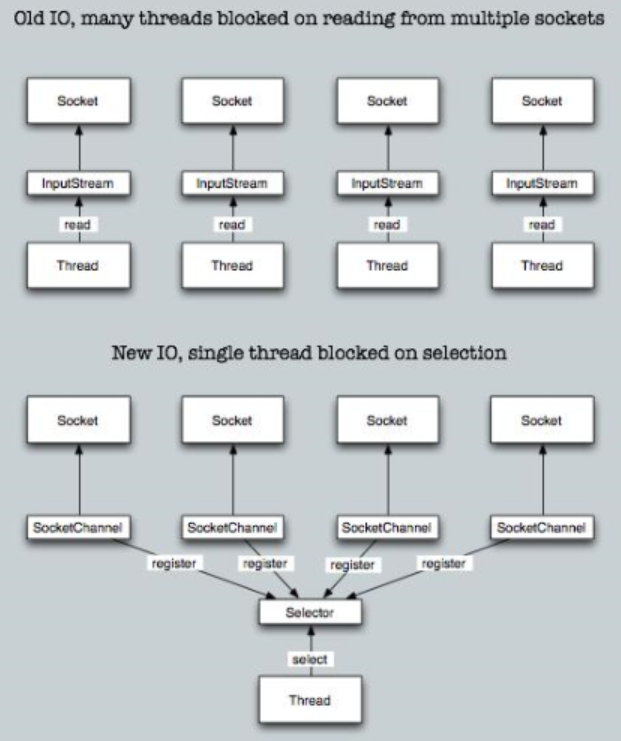

## 5.4 Netty 面试题总结

### 5.4.1 Netty 是什么？

- Netty 是一个 基于 NIO 的 client-server(客户端服务器)框架，使用它可以快速简单地开发网络应用程序
- 支持多种协议 如 FTP，SMTP，HTTP 以及各种二进制和基于文本的传统协议。
- Netty是基于nio的，它封装了jdk的nio，让我们使用起来更加方便灵活。

很多开源项目比如我们常用的 Dubbo、RocketMQ、Elasticsearch 等等都用到了 Netty

### 5.4.2 Netty的特点是什么？

- 高并发：Netty 是一款基于 NIO（Nonblocking IO，非阻塞IO）开发的网络通信框架，对比于 BIO（Blocking I/O，阻塞IO），他的并发性能得到了很大提高。
- 传输快：Netty 的传输依赖于零拷贝特性，尽量减少不必要的内存拷贝，实现了更高效率的传输。
- 封装好：Netty 封装了 NIO 操作的很多细节，提供了易于使用调用接口。

- 使用简单：封装了 NIO 的很多细节，使用更简单。
- 功能强大：自带编解码器解决 TCP 粘包/拆包问题。
- 定制能力强：可以通过 ChannelHandler 对通信框架进行灵活地扩展。
- 性能高：更高的吞吐量、更低的延迟、更低的资源消耗和更少的内存复制。
- 稳定：Netty 修复了已经发现的所有 NIO 的 bug，让开发人员可以专注于业务本身。
- 社区活跃：Netty 是活跃的开源项目，版本迭代周期短，bug 修复速度快。

### 5.4.3 Netty 应用场景有哪些？

典型的应用有：阿里分布式服务框架 Dubbo，默认使用 Netty 作为基础通信组件，还有 RocketMQ 也是使用 Netty 作为通讯的基础。

Netty 主要用来做**网络通信** :

- **作为 RPC 框架的网络通信工具** ： 我们在分布式系统中，不同服务节点之间经常需要相互调用，这个时候就需要 RPC 框架了。不同服务节点之间的通信是如何做的呢？可以使用 Netty 来做。比如我调用另外一个节点的方法的话，至少是要让对方知道我调用的是哪个类中的哪个方法以及相关参数吧！
- **实现一个自己的 HTTP 服务器** ：通过 Netty 我们可以自己实现一个简单的 HTTP 服务器，这个大家应该不陌生。说到 HTTP 服务器的话，作为 Java 后端开发，我们一般使用 Tomcat 比较多。一个最基本的 HTTP 服务器可要以处理常见的 HTTP Method 的请求，比如 POST 请求、GET 请求等等。
- **实现一个即时通讯系统** ： 使用 Netty 我们可以实现一个可以聊天类似微信的即时通讯系统

### 5.4.4Netty 核心组件有哪些？分别有什么作用？

#### 1.Channel

`Channel` 接口是 Netty 对网络操作抽象类，它除了包括基本的 I/O 操作，如 `bind()`、`connect()`、`read()`、`write()` 等。

比较常用的`Channel`接口实现类是`NioServerSocketChannel`（服务端）和`NioSocketChannel`（客户端），这两个 `Channel` 可以和 BIO 编程模型中的`ServerSocket`以及`Socket`两个概念对应上。Netty 的 `Channel` 接口所提供的 API，大大地降低了直接使用 Socket 类的复杂性。

#### 2.EventLoop

这么说吧！`EventLoop`（事件循环）接口可以说是 Netty 中最核心的概念了！

《Netty 实战》这本书是这样介绍它的：

> `EventLoop` 定义了 Netty 的核心抽象，用于处理连接的生命周期中所发生的事件。

是不是很难理解？说实话，我学习 Netty 的时候看到这句话是没太能理解的。

说白了，**`EventLoop` 的主要作用实际就是负责监听网络事件并调用事件处理器进行相关 I/O 操作的处理。**

那 `Channel` 和 `EventLoop` 直接有啥联系呢？

`Channel` 为 Netty 网络操作(读写等操作)抽象类，`EventLoop` 负责处理注册到其上的`Channel` 处理 I/O 操作，两者配合参与 I/O 操作。

#### 3.ChannelFuture

Netty 是异步非阻塞的，所有的 I/O 操作都为异步的。

因此，我们不能立刻得到操作是否执行成功，但是，你可以通过 `ChannelFuture` 接口的 `addListener()` 方法注册一个 `ChannelFutureListener`，当操作执行成功或者失败时，监听就会自动触发返回结果。

并且，你还可以通过`ChannelFuture` 的 `channel()` 方法获取关联的`Channel`

```java
public interface ChannelFuture extends Future<Void> {
    Channel channel();

    ChannelFuture addListener(GenericFutureListener<? extends Future<? super Void>> var1);
     ......

    ChannelFuture sync() throws InterruptedException;
}
```

另外，我们还可以通过 `ChannelFuture` 接口的 `sync()`方法让异步的操作变成同步的。

#### 4.ChannelHandler 和 ChannelPipeline

下面这段代码使用过 Netty 的小伙伴应该不会陌生，我们指定了序列化编解码器以及自定义的 `ChannelHandler` 处理消息。

```java
        b.group(eventLoopGroup)
                .handler(new ChannelInitializer<SocketChannel>() {
                    @Override
                    protected void initChannel(SocketChannel ch) {
                        ch.pipeline().addLast(new NettyKryoDecoder(kryoSerializer, RpcResponse.class));
                        ch.pipeline().addLast(new NettyKryoEncoder(kryoSerializer, RpcRequest.class));
                        ch.pipeline().addLast(new KryoClientHandler());
                    }
                });
```

`ChannelHandler` 是消息的具体处理器。他负责处理读写操作、客户端连接等事情。

`ChannelPipeline` 为 `ChannelHandler` 的链，提供了一个容器并定义了用于沿着链传播入站和出站事件流的 API 。当 `Channel` 被创建时，它会被自动地分配到它专属的 `ChannelPipeline`。

我们可以在 `ChannelPipeline` 上通过 `addLast()` 方法添加一个或者多个`ChannelHandler` ，因为一个数据或者事件可能会被多个 Handler 处理。当一个 `ChannelHandler` 处理完之后就将数据交给下一个 `ChannelHandler` 。

### 5.4.5 EventloopGroup 了解么?和 EventLoop 啥关系?



`EventLoopGroup` 包含多个 `EventLoop`（每一个 `EventLoop` 通常内部包含一个线程），上面我们已经说了 `EventLoop` 的主要作用实际就是负责监听网络事件并调用事件处理器进行相关 I/O 操作的处理。

并且 `EventLoop` 处理的 I/O 事件都将在它专有的 `Thread` 上被处理，即 `Thread` 和 `EventLoop` 属于 1 : 1 的关系，从而保证线程安全。

上图是一个服务端对 `EventLoopGroup` 使用的大致模块图，其中 `Boss EventloopGroup` 用于接收连接，`Worker EventloopGroup` 用于具体的处理（消息的读写以及其他逻辑处理）。

从上图可以看出： 当客户端通过 `connect` 方法连接服务端时，`bossGroup` 处理客户端连接请求。当客户端处理完成后，会将这个连接提交给 `workerGroup` 来处理，然后 `workerGroup` 负责处理其 IO 相关操作。

### 5.4.6 Bootstrap 和 ServerBootstrap 了解么？

`Bootstrap` 是客户端的启动引导类/辅助类，具体使用方法如下：

```java
        EventLoopGroup group = new NioEventLoopGroup();
        try {
            //创建客户端启动引导/辅助类：Bootstrap
            Bootstrap b = new Bootstrap();
            //指定线程模型
            b.group(group).
                    ......
            // 尝试建立连接
            ChannelFuture f = b.connect(host, port).sync();
            f.channel().closeFuture().sync();
        } finally {
            // 优雅关闭相关线程组资源
            group.shutdownGracefully();
        }
```

`ServerBootstrap` 服务端的启动引导类/辅助类，具体使用方法如下：

```java
        // 1.bossGroup 用于接收连接，workerGroup 用于具体的处理
        EventLoopGroup bossGroup = new NioEventLoopGroup(1);
        EventLoopGroup workerGroup = new NioEventLoopGroup();
        try {
            //2.创建服务端启动引导/辅助类：ServerBootstrap
            ServerBootstrap b = new ServerBootstrap();
            //3.给引导类配置两大线程组,确定了线程模型
            b.group(bossGroup, workerGroup).
                   ......
            // 6.绑定端口
            ChannelFuture f = b.bind(port).sync();
            // 等待连接关闭
            f.channel().closeFuture().sync();
        } finally {
            //7.优雅关闭相关线程组资源
            bossGroup.shutdownGracefully();
            workerGroup.shutdownGracefully();
        }
    }
```

从上面的示例中，我们可以看出：

1. `Bootstrap` 通常使用 `connet()` 方法连接到远程的主机和端口，作为一个 Netty TCP 协议通信中的客户端。另外，`Bootstrap` 也可以通过 `bind()` 方法绑定本地的一个端口，作为 UDP 协议通信中的一端。
2. `ServerBootstrap`通常使用 `bind()` 方法绑定本地的端口上，然后等待客户端的连接。
3. `Bootstrap` 只需要配置一个线程组— `EventLoopGroup` ,而 `ServerBootstrap`需要配置两个线程组— `EventLoopGroup` ，一个用于接收连接，一个用于具体的处理。

### 5.4.7 NioEventLoopGroup 默认的构造函数会起多少线程？

👨‍💻**面试官** ：看过 Netty 的源码了么？`NioEventLoopGroup` 默认的构造函数会起多少线程呢？

🙋 **我** ：嗯嗯！看过部分。

回顾我们在上面写的服务器端的代码：

```java
// 1.bossGroup 用于接收连接，workerGroup 用于具体的处理
EventLoopGroup bossGroup = new NioEventLoopGroup(1);
EventLoopGroup workerGroup = new NioEventLoopGroup();
```

为了搞清楚`NioEventLoopGroup` 默认的构造函数 到底创建了多少个线程，我们来看一下它的源码。

```java
    /**
     * 无参构造函数。
     * nThreads:0
     */
    public NioEventLoopGroup() {
        //调用下一个构造方法
        this(0);
    }

    /**
     * Executor：null
     */
    public NioEventLoopGroup(int nThreads) {
        //继续调用下一个构造方法
        this(nThreads, (Executor) null);
    }

    //中间省略部分构造函数

    /**
     * RejectedExecutionHandler（）：RejectedExecutionHandlers.reject()
     */
    public NioEventLoopGroup(int nThreads, Executor executor, final SelectorProvider selectorProvider,final SelectStrategyFactory selectStrategyFactory) {
       //开始调用父类的构造函数
        super(nThreads, executor, selectorProvider, selectStrategyFactory, RejectedExecutionHandlers.reject());
    }

```

一直向下走下去的话，你会发现在 `MultithreadEventLoopGroup` 类中有相关的指定线程数的代码，如下：

```java
    // 从1，系统属性，CPU核心数*2 这三个值中取出一个最大的
    //可以得出 DEFAULT_EVENT_LOOP_THREADS 的值为CPU核心数*2
    private static final int DEFAULT_EVENT_LOOP_THREADS = Math.max(1, SystemPropertyUtil.getInt("io.netty.eventLoopThreads", NettyRuntime.availableProcessors() * 2));

    // 被调用的父类构造函数，NioEventLoopGroup 默认的构造函数会起多少线程的秘密所在
    // 当指定的线程数nThreads为0时，使用默认的线程数DEFAULT_EVENT_LOOP_THREADS
    protected MultithreadEventLoopGroup(int nThreads, ThreadFactory threadFactory, Object... args) {
        super(nThreads == 0 ? DEFAULT_EVENT_LOOP_THREADS : nThreads, threadFactory, args);
    }
```

综上，我们发现 `NioEventLoopGroup` 默认的构造函数实际会起的线程数为 **`CPU核心数*2`**。

另外，如果你继续深入下去看构造函数的话，你会发现每个`NioEventLoopGroup`对象内部都会分配一组`NioEventLoop`，其大小是 `nThreads`, 这样就构成了一个线程池， 一个`NIOEventLoop` 和一个线程相对应，这和我们上面说的 `EventloopGroup` 和 `EventLoop`关系这部分内容相对应。

### 5.4.8 Netty 线程模型了解么？

👨‍💻**面试官** ：说一下 Netty 线程模型吧！

🙋 **我** ：大部分网络框架都是基于 Reactor 模式设计开发的。

> Reactor 模式基于事件驱动，采用多路复用将事件分发给相应的 Handler 处理，非常适合处理海量 IO 的场景。

在 Netty 主要靠 `NioEventLoopGroup` 线程池来实现具体的线程模型的 。

我们实现服务端的时候，一般会初始化两个线程组：

1. **`bossGroup`** :接收连接。
2. **`workerGroup`** ：负责具体的处理，交由对应的 Handler 处理。

下面我们来详细看一下 Netty 中的线程模型吧！

1.**单线程模型** ：

一个线程需要执行处理所有的 `accept`、`read`、`decode`、`process`、`encode`、`send` 事件。对于高负载、高并发，并且对性能要求比较高的场景不适用。

对应到 Netty 代码是下面这样的

> 使用 `NioEventLoopGroup` 类的无参构造函数设置线程数量的默认值就是 **CPU 核心数 \*2** 。

```java
  //1.eventGroup既用于处理客户端连接，又负责具体的处理。
  EventLoopGroup eventGroup = new NioEventLoopGroup(1);
  //2.创建服务端启动引导/辅助类：ServerBootstrap
  ServerBootstrap b = new ServerBootstrap();
            boobtstrap.group(eventGroup, eventGroup)
            //......
```

2.**多线程模型**

一个 Acceptor 线程只负责监听客户端的连接，一个 NIO 线程池负责具体处理： `accept`、`read`、`decode`、`process`、`encode`、`send` 事件。满足绝大部分应用场景，并发连接量不大的时候没啥问题，但是遇到并发连接大的时候就可能会出现问题，成为性能瓶颈。

对应到 Netty 代码是下面这样的：

```java
// 1.bossGroup 用于接收连接，workerGroup 用于具体的处理
EventLoopGroup bossGroup = new NioEventLoopGroup(1);
EventLoopGroup workerGroup = new NioEventLoopGroup();
try {
  //2.创建服务端启动引导/辅助类：ServerBootstrap
  ServerBootstrap b = new ServerBootstrap();
  //3.给引导类配置两大线程组,确定了线程模型
  b.group(bossGroup, workerGroup)
    //......
```



**3.主从多线程模型**

从一个 主线程 NIO 线程池中选择一个线程作为 Acceptor 线程，绑定监听端口，接收客户端连接的连接，其他线程负责后续的接入认证等工作。连接建立完成后，Sub NIO 线程池负责具体处理 I/O 读写。如果多线程模型无法满足你的需求的时候，可以考虑使用主从多线程模型 。

```java
// 1.bossGroup 用于接收连接，workerGroup 用于具体的处理
EventLoopGroup bossGroup = new NioEventLoopGroup();
EventLoopGroup workerGroup = new NioEventLoopGroup();
try {
  //2.创建服务端启动引导/辅助类：ServerBootstrap
  ServerBootstrap b = new ServerBootstrap();
  //3.给引导类配置两大线程组,确定了线程模型
  b.group(bossGroup, workerGroup)
    //......
```



### 5.4.9 Netty 服务端和客户端的启动过程了解么？

#### 服务端

```java
        // 1.bossGroup 用于接收连接，workerGroup 用于具体的处理
        EventLoopGroup bossGroup = new NioEventLoopGroup(1);
        EventLoopGroup workerGroup = new NioEventLoopGroup();
        try {
            //2.创建服务端启动引导/辅助类：ServerBootstrap
            ServerBootstrap b = new ServerBootstrap();
            //3.给引导类配置两大线程组,确定了线程模型
            b.group(bossGroup, workerGroup)
                    // (非必备)打印日志
                    .handler(new LoggingHandler(LogLevel.INFO))
                    // 4.指定 IO 模型
                    .channel(NioServerSocketChannel.class)
                    .childHandler(new ChannelInitializer<SocketChannel>() {
                        @Override
                        public void initChannel(SocketChannel ch) {
                            ChannelPipeline p = ch.pipeline();
                            //5.可以自定义客户端消息的业务处理逻辑
                            p.addLast(new HelloServerHandler());
                        }
                    });
            // 6.绑定端口,调用 sync 方法阻塞知道绑定完成
            ChannelFuture f = b.bind(port).sync();
            // 7.阻塞等待直到服务器Channel关闭(closeFuture()方法获取Channel 的CloseFuture对象,然后调用sync()方法)
            f.channel().closeFuture().sync();
        } finally {
            //8.优雅关闭相关线程组资源
            bossGroup.shutdownGracefully();
            workerGroup.shutdownGracefully();
        }
```

简单解析一下服务端的创建过程具体是怎样的：

1.首先你创建了两个 `NioEventLoopGroup` 对象实例：`bossGroup` 和 `workerGroup`。

- `bossGroup` : 用于处理客户端的 TCP 连接请求。
- `workerGroup` ： 负责每一条连接的具体读写数据的处理逻辑，真正负责 I/O 读写操作，交由对应的 Handler 处理。

举个例子：我们把公司的老板当做 bossGroup，员工当做 workerGroup，bossGroup 在外面接完活之后，扔给 workerGroup 去处理。一般情况下我们会指定 bossGroup 的 线程数为 1（并发连接量不大的时候） ，workGroup 的线程数量为 **CPU 核心数 \*2** 。另外，根据源码来看，使用 `NioEventLoopGroup` 类的无参构造函数设置线程数量的默认值就是 **CPU 核心数 \*2** 。

2.接下来 我们创建了一个服务端启动引导/辅助类： `ServerBootstrap`，这个类将引导我们进行服务端的启动工作。

3.通过 `.group()` 方法给引导类 `ServerBootstrap` 配置两大线程组，确定了线程模型。

通过下面的代码，我们实际配置的是多线程模型，这个在上面提到过。

```java
    EventLoopGroup bossGroup = new NioEventLoopGroup(1);
    EventLoopGroup workerGroup = new NioEventLoopGroup();
```

4.通过`channel()`方法给引导类 `ServerBootstrap`指定了 IO 模型为`NIO`

- `NioServerSocketChannel` ：指定服务端的 IO 模型为 NIO，与 BIO 编程模型中的`ServerSocket`对应
- `NioSocketChannel` : 指定客户端的 IO 模型为 NIO， 与 BIO 编程模型中的`Socket`对应

  5.通过 `.childHandler()`给引导类创建一个`ChannelInitializer` ，然后指定了服务端消息的业务处理逻辑 `HelloServerHandler` 对象

  6.调用 `ServerBootstrap` 类的 `bind()`方法绑定端口

#### 客户端

```java
        //1.创建一个 NioEventLoopGroup 对象实例
        EventLoopGroup group = new NioEventLoopGroup();
        try {
            //2.创建客户端启动引导/辅助类：Bootstrap
            Bootstrap b = new Bootstrap();
            //3.指定线程组
            b.group(group)
                    //4.指定 IO 模型
                    .channel(NioSocketChannel.class)
                    .handler(new ChannelInitializer<SocketChannel>() {
                        @Override
                        public void initChannel(SocketChannel ch) throws Exception {
                            ChannelPipeline p = ch.pipeline();
                            // 5.这里可以自定义消息的业务处理逻辑
                            p.addLast(new HelloClientHandler(message));
                        }
                    });
            // 6.尝试建立连接
            ChannelFuture f = b.connect(host, port).sync();
            // 7.等待连接关闭（阻塞，直到Channel关闭）
            f.channel().closeFuture().sync();
        } finally {
            group.shutdownGracefully();
        }
```

继续分析一下客户端的创建流程：

1.创建一个 `NioEventLoopGroup` 对象实例

2.创建客户端启动的引导类是 `Bootstrap`

3.通过 `.group()` 方法给引导类 `Bootstrap` 配置一个线程组

4.通过`channel()`方法给引导类 `Bootstrap`指定了 IO 模型为`NIO`

5.通过 `.childHandler()`给引导类创建一个`ChannelInitializer` ，然后指定了客户端消息的业务处理逻辑 `HelloClientHandler` 对象

6.调用 `Bootstrap` 类的 `connect()`方法进行连接，这个方法需要指定两个参数：

- `inetHost` : ip 地址
- `inetPort` : 端口号

```java
    public ChannelFuture connect(String inetHost, int inetPort) {
        return this.connect(InetSocketAddress.createUnresolved(inetHost, inetPort));
    }
    public ChannelFuture connect(SocketAddress remoteAddress) {
        ObjectUtil.checkNotNull(remoteAddress, "remoteAddress");
        this.validate();
        return this.doResolveAndConnect(remoteAddress, this.config.localAddress());
    }
```

`connect` 方法返回的是一个 `Future` 类型的对象

```java
public interface ChannelFuture extends Future<Void> {
  ......
}
```

也就是说这个方是异步的，我们通过 `addListener` 方法可以监听到连接是否成功，进而打印出连接信息。具体做法很简单，只需要对代码进行以下改动：

```java
ChannelFuture f = b.connect(host, port).addListener(future -> {
  if (future.isSuccess()) {
    System.out.println("连接成功!");
  } else {
    System.err.println("连接失败!");
  }
}).sync();
```

### 5.4.10 什么是 TCP 粘包/拆包?有什么解决办法呢？

TCP 粘包/拆包 就是你基于 TCP 发送数据的时候，出现了多个字符串“粘”在了一起或者一个字符串被“拆”开的问题。比如你多次发送：“你好,你真帅啊！哥哥！”，但是客户端接收到的可能是下面这样的：



👨‍💻**面试官** ：那有什么解决办法呢?

🙋 **我** ：

**1.使用 Netty 自带的解码器**

- **`LineBasedFrameDecoder`** : 发送端发送数据包的时候，每个数据包之间以换行符作为分隔，`LineBasedFrameDecoder` 的工作原理是它依次遍历 `ByteBuf` 中的可读字节，判断是否有换行符，然后进行相应的截取。
- **`DelimiterBasedFrameDecoder`** : 可以自定义分隔符解码器，**`LineBasedFrameDecoder`** 实际上是一种特殊的 `DelimiterBasedFrameDecoder` 解码器。
- **`FixedLengthFrameDecoder`**: 固定长度解码器，它能够按照指定的长度对消息进行相应的拆包。
- **`LengthFieldBasedFrameDecoder`**：

**2.自定义序列化编解码器**

在 Java 中自带的有实现 `Serializable` 接口来实现序列化，但由于它性能、安全性等原因一般情况下是不会被使用到的。

通常情况下，我们使用 Protostuff、Hessian2、json 序列方式比较多，另外还有一些序列化性能非常好的序列化方式也是很好的选择：

- 专门针对 Java 语言的：Kryo，FST 等等
- 跨语言的：Protostuff（基于 protobuf 发展而来），ProtoBuf，Thrift，Avro，MsgPack 等等

> 由于篇幅问题，这部分内容会在后续的文章中详细分析介绍~~~

### 5.4.11 Netty 长连接、心跳机制了解么？

👨‍💻**面试官** ：TCP 长连接和短连接了解么？

🙋 **我** ：我们知道 TCP 在进行读写之前，server 与 client 之间必须提前建立一个连接。建立连接的过程，需要我们常说的三次握手，释放/关闭连接的话需要四次挥手。这个过程是比较消耗网络资源并且有时间延迟的。

所谓，短连接说的就是 server 端 与 client 端建立连接之后，读写完成之后就关闭掉连接，如果下一次再要互相发送消息，就要重新连接。短连接的优点很明显，就是管理和实现都比较简单，缺点也很明显，每一次的读写都要建立连接必然会带来大量网络资源的消耗，并且连接的建立也需要耗费时间。

长连接说的就是 client 向 server 双方建立连接之后，即使 client 与 server 完成一次读写，它们之间的连接并不会主动关闭，后续的读写操作会继续使用这个连接。长连接的可以省去较多的 TCP 建立和关闭的操作，降低对网络资源的依赖，节约时间。对于频繁请求资源的客户来说，非常适用长连接。

👨‍💻**面试官** ：为什么需要心跳机制？Netty 中心跳机制了解么？

🙋 **我** ：

在 TCP 保持长连接的过程中，可能会出现断网等网络异常出现，异常发生的时候， client 与 server 之间如果没有交互的话，它们是无法发现对方已经掉线的。为了解决这个问题, 我们就需要引入 **心跳机制** 。

心跳机制的工作原理是: 在 client 与 server 之间在一定时间内没有数据交互时, 即处于 idle 状态时, 客户端或服务器就会发送一个特殊的数据包给对方, 当接收方收到这个数据报文后, 也立即发送一个特殊的数据报文, 回应发送方, 此即一个 PING-PONG 交互。所以, 当某一端收到心跳消息后, 就知道了对方仍然在线, 这就确保 TCP 连接的有效性.

TCP 实际上自带的就有长连接选项，本身是也有心跳包机制，也就是 TCP 的选项：`SO_KEEPALIVE`。 但是，TCP 协议层面的长连接灵活性不够。所以，一般情况下我们都是在应用层协议上实现自定义心跳机制的，也就是在 Netty 层面通过编码实现。通过 Netty 实现心跳机制的话，核心类是 `IdleStateHandler` 。

### 5.4.12 Netty 的零拷贝了解么？

维基百科是这样介绍零拷贝的：

> 零复制（英语：Zero-copy；也译零拷贝）技术是指计算机执行操作时，CPU 不需要先将数据从某处内存复制到另一个特定区域。这种技术通常用于通过网络传输文件时节省 CPU 周期和内存带宽。

在 OS 层面上的 `Zero-copy` 通常指避免在 `用户态(User-space)` 与 `内核态(Kernel-space)` 之间来回拷贝数据。而在 Netty 层面 ，零拷贝主要体现在对于数据操作的优化。

Netty 中的零拷贝体现在以下几个方面

1. 使用 Netty 提供的 `CompositeByteBuf` 类, 可以将多个`ByteBuf` 合并为一个逻辑上的 `ByteBuf`, 避免了各个 `ByteBuf` 之间的拷贝。
2. `ByteBuf` 支持 slice 操作, 因此可以将 ByteBuf 分解为多个共享同一个存储区域的 `ByteBuf`, 避免了内存的拷贝。
3. 通过 `FileRegion` 包装的`FileChannel.tranferTo` 实现文件传输, 可以直接将文件缓冲区的数据发送到目标 `Channel`, 避免了传统通过循环 write 方式导致的内存拷贝问题.

### 5.4.13BIO、NIO和AIO的区别

IO的方式通常分为几种，**同步阻塞的BIO**、**同步非阻塞的NIO**、**异步非阻塞的AIO**。

**BIO**:

在JDK1.4出来之前，我们建立网络连接的时候采用BIO模式，需要先在服务端启动一个ServerSocket，然后在客户端启动Socket来对服务端进行通信，默认情况下服务端需要对每个请求建立一堆线程等待请求，而客户端发送请求后，先咨询服务端是否有线程相应，如果没有则会一直等待或者遭到拒绝请求，如果有的话，客户端线程会等待请求结束后才继续执行。

**NIO**:

NIO本身是基于事件驱动思想来完成的，其主要想解决的是BIO的大并发问题： 在使用同步I/O的网络应用中，如果要同时处理多个客户端请求，或是在客户端要同时和多个服务器进行通讯，就必须使用多线程来处理。也就是说，将每一个客户端请求分配给一个线程来单独处理。这样做虽然可以达到我们的要求，但同时又会带来另外一个问题。由于每创建一个线程，就要为这个线程分配一定的内存空间（也叫工作存储器），而且操作系统本身也对线程的总数有一定的限制。如果客户端的请求过多，服务端程序可能会因为不堪重负而拒绝客户端的请求，甚至服务器可能会因此而瘫痪。

  NIO基于Reactor，当socket有流可读或可写入socket时，操作系统会相应的通知引用程序进行处理，应用再将流读取到缓冲区或写入操作系统。 也就是说，这个时候，已经不是一个连接就要对应一个处理线程了，而是有效的请求，对应一个线程，当连接没有数据时，是没有工作线程来处理的。

  BIO与NIO一个比较重要的不同，是我们使用BIO的时候往往会引入多线程，每个连接一个单独的线程；而NIO则是使用单线程或者只使用少量的多线程，每个连接共用一个线程。



NIO的最重要的地方是当一个连接创建后，不需要对应一个线程，这个连接会被注册到多路复用器上面，所以所有的连接只需要一个线程就可以搞定，当这个线程中的多路复用器进行轮询的时候，发现连接上有请求的话，才开启一个线程进行处理，也就是一个请求一个线程模式。

   在NIO的处理方式中，当一个请求来的话，开启线程进行处理，可能会等待后端应用的资源(JDBC连接等)，其实这个线程就被阻塞了，当并发上来的话，还是会有BIO一样的问题。

　　HTTP/1.1出现后，有了Http长连接，这样除了超时和指明特定关闭的http header外，这个链接是一直打开的状态的，这样在NIO处理中可以进一步的进化，在后端资源中可以实现资源池或者队列，当请求来的话，开启的线程把请求和请求数据传送给后端资源池或者队列里面就返回，并且在全局的地方保持住这个现场(哪个连接的哪个请求等)，这样前面的线程还是可以去接受其他的请求，而后端的应用的处理只需要执行队列里面的就可以了，这样请求处理和后端应用是异步的.当后端处理完，到全局地方得到现场，产生响应，这个就实现了异步处理。

**AIO**:

与NIO不同，当进行读写操作时，只须直接调用API的read或write方法即可。这两种方法均为异步的，对于读操作而言，当有流可读取时，操作系统会将可读的流传入read方法的缓冲区，并通知应用程序；对于写操作而言，当操作系统将write方法传递的流写入完毕时，操作系统主动通知应用程序。 即可以理解为，read/write方法都是异步的，完成后会主动调用回调函数。

Java对BIO、NIO、AIO的支持：

**Java BIO** ： 同步并阻塞，服务器实现模式为一个连接一个线程，即客户端有连接请求时服务器端就需要启动一个线程进行处理，如果这个连接不做任何事情会造成不必要的线程开销，当然可以通过线程池机制改善。

**Java NIO** ： 同步非阻塞，服务器实现模式为一个请求一个线程，即客户端发送的连接请求都会注册到多路复用器上，多路复用器轮询到连接有I/O请求时才启动一个线程进行处理。

**Java AIO(NIO.2)** ： 异步非阻塞，服务器实现模式为一个有效请求一个线程，客户端的I/O请求都是由OS先完成了再通知服务器应用去启动线程进行处理

BIO、NIO、AIO适用场景分析:

BIO方式适用于连接数目比较小且固定的架构，这种方式对服务器资源要求比较高，并发局限于应用中，JDK1.4以前的唯一选择，但程序直观简单易理解。

NIO方式适用于连接数目多且连接比较短（轻操作）的架构，比如聊天服务器，并发局限于应用中，编程比较复杂，JDK1.4开始支持。

AIO方式适用于连接数目多且连接比较长（重操作）的架构，比如相册服务器，充分调用OS参与并发操作，编程比较复杂，JDK7开始支持。